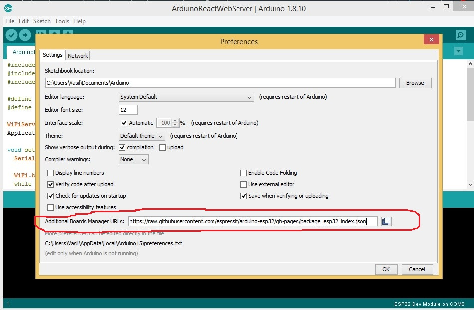
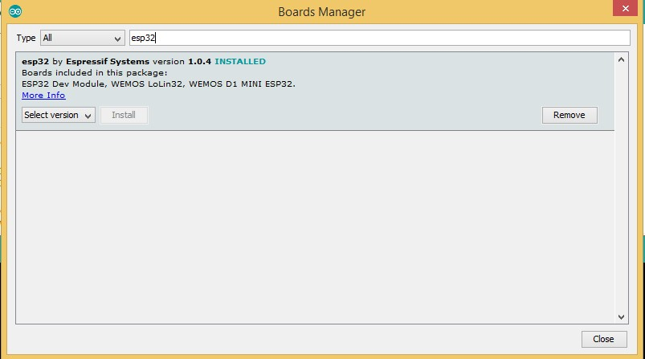
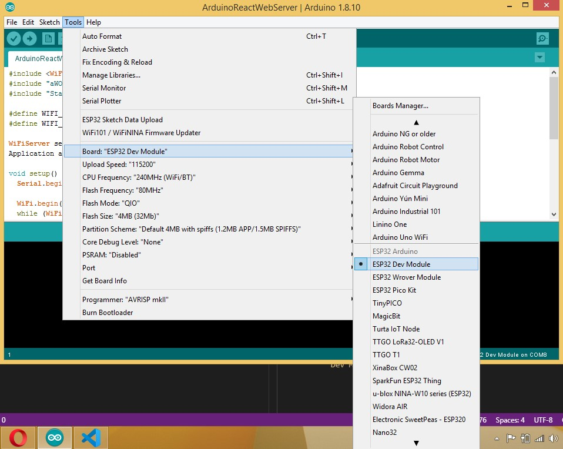
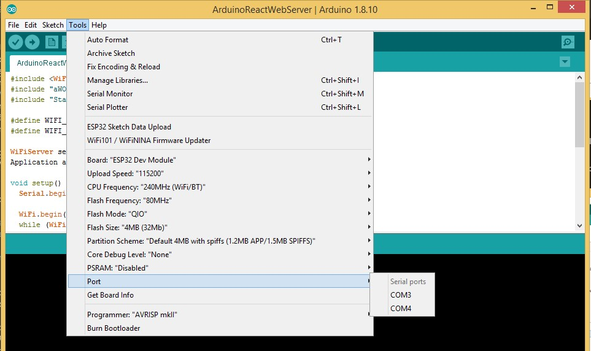
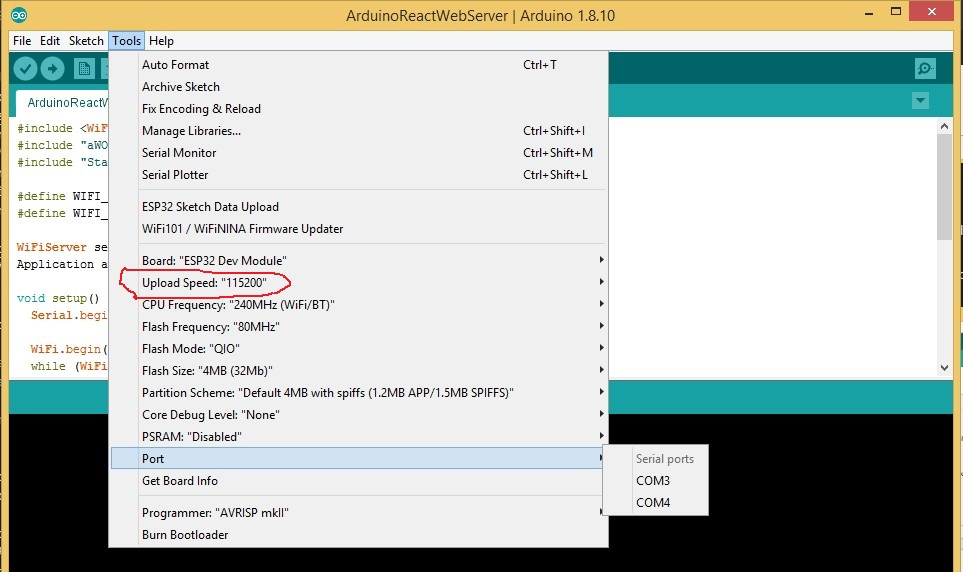
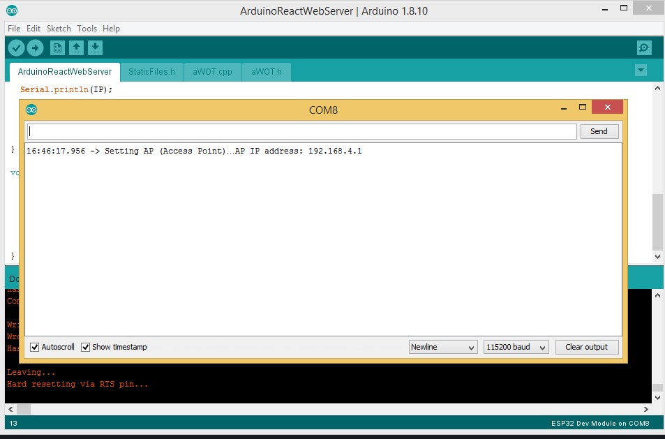
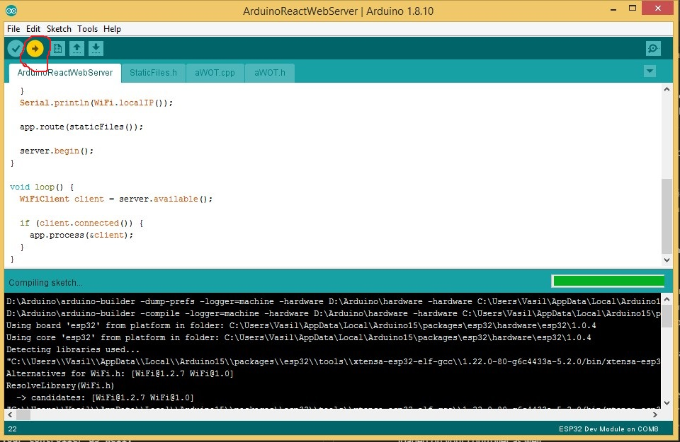
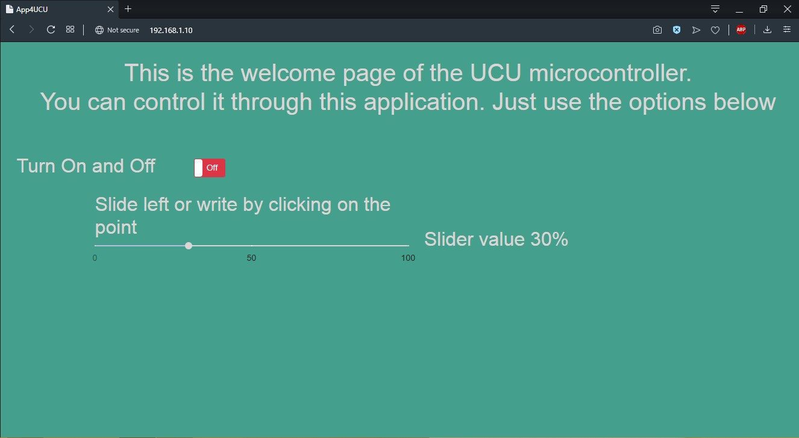

# **Setup and Upload code on the Arduino**

Since we all have gotten the same ESP32 nodeMCU the easiest way to upload a code on it, is using the `Arduino IDE` (in my opinion). Nevertheless, you will also need `Node.js` in order to initialize, bundle and deploy the `React.js` code.

## **Environment Setup**
Make sure to download and install **all** technologies listed below
### The link for each of this *prerequisites* can be found here:
 * [Arduino IDE](https://www.arduino.cc/en/main/software).
 * [Node.js ](https://nodejs.org/en/download/).
   * to make sure `Node.js` is working after downloading and installing. 
Open your console and type `node -v` and `npm -v`
If everything is done correctly you should something similar to that
 
   * Make sure that you have at least the versions shown in the previous window i.e : node: v 12.3.1  and npm: v 6.9.0. If you there are newer versions it is **completely fine or maybe even recommended** to install. However, if you install previous versions of the ones listed it may cause some install and compilation problems.  

### *Helpful Links* 
* [ESP32 Arduino serving a React.js App](https://techtutorialsx.com/2019/03/24/esp32-arduino-serving-a-react-js-app/)
* [React JS Crash Course](https://youtu.be/sBws8MSXN7A)
* [Arduino Tutorial](https://www.youtube.com/watch?v=QO_Jlz1qpDw)

### **IMPORTANT**
After downloading and installing all of the above, you will also need to setup the *Arduino core for the ESP32*.  To do this follow this steps:
1. After installing `Arduino IDE`, run it and then click on `File`  and open `Preferences`.
2. Then add the following link to the `Additional Board Manager` URLs  field and click OK. \
LINK: https://raw.githubusercontent.com/espressif/arduino-esp32/gh-pages/package_esp32_index.json

3. Click `Tools` -> `Board:` -> `Boards Manager` then type in `esp32` in the search field and click *install*. 

4. Wait until installation is finished then restart `Arduino IDE`
5. **IMPORTANT!** \
Do no forget to choose the right board when you are done with the previous steps.  \
To do this go again to  `Tools` -> `Board:` -> Click on the down pointing arrow then search for `ESP32 Dev Module` and choose it.

6. **IMPORTANT!** \
Do not forget to also choose the Port to which your nodeMCU is connected to.  \

7. Once you are done with previous steps, go again to `Tools`, click on `Upload Speed` and choose  `115200`.

### **Congratulations!** This were all the steps you needed to follow to complete the Arduino IDE environment setup.

# Upload and Run React.js code as a webserver for the Arduino.

 1. Download or clone latest GitHub code pushed to the master inside this repo. Then go to `App4UCU/Frontend/` directory
    * All Arduino files are located inside the `App4UCU/Frontend/ArduinoReactWebServer` directory. 
 2. Open your console and type `npm install` then press enter. *This might take a while depending on your system.*
 3. After previous step is finished type `npm start` and press enter. 
    * Normally, this command would open up your default browser and load the app automatically after couple of seconds. 

If that is not the case, open your favorite browser and type  http://localhost:3000 in an open tab and press enter. \
Now you should be able to further develop the React.js code and whenever you save some changes inside your editor the development server will reload rerender the `DOM` and you will be able to see your changes in the same opened tab. \
Furthermore, you also have the option to change and update the Arduino Backend code as well *(see next section)*.

 # To edit and upload your code to the nodeMCU you need to do the following
1.  You can modify the Acces Point (AP), if you want your controller to have diffeent network name and password.

 * You will have to open the file called `ArduinoReactWebServer.ino` inside the `App4UCU/Frontend/ArduinoReactWebServer` directory. 
   * You will have to change these two lines 
     * `#define WIFI_SSID "Type WiFi Network name here"` 
     * `#define WIFI_PASSWORD "Type password for this network here"`
   * Just input whatever you want to have as your Network `Name` and `Password`. There are some additional parameters like hide the network, max. number of clients connect, etc. which you can also use if you like. All of these parameters can be found inside the `ArduinoReactWebServer.ino`
 
 2. Open your console inside the `App4UCU/Frontend/` directory,  
then type  `npm run build` and press enter.
    * This command will create a new directory called `build` and this new directory will contain the minified JavaScript, HTML as well as CSS files. Additionally, any other static files like images will be there too.

 3. To convert the files within the `App4UCU/Frontend/build` directory to a Arduino compatible format some configurations need to be added to the `package.json`. 
    * I have alread configurated this for our project with the help of `aWOT-scripts`.  
    * However, If you want to see these configurations open `package.json` inside `App4UCU/Frontend/` and check out everything after `"devDependencies": { "awot-scripts": "0.0.xx"}, `
 4.  After previous steps are finished type `npm run dist` in your console and press enter.
 5. Go to the `ArduinoReactWebServer` directory and checkout the `Staticfiles.h` It is a script generated file that contains the proper `HTTP Headers for encoding, Cache control, Response length, content type`, etc. 
  I guess towards the end of the project, we will **NOT** upload this file to *GitHub repo* as it can contain sensitive information, which can be easily manipulated.

 6. After previous steps are done open the `ArduinoReactWebServer.ino` in the same directory and if you have followed everything up until now correctly you should be able to upload this code to the nodeMCU and see the `Frontend` code loaded on your controller as well.
    * But before that if you do not know the `IP Addresses` of your nodeMCU controller.  You need to do the following before uploading the code to it.

 * Open the `Serial Monitor`, because when the upload is done the `IP Address` of the nodeMCU will be printed out there. You will need to input this `IP Address` in an open tab inside your browser to see the `React.js` code for the webserver directly loaded on the nodeMCU.
   *  To do that either press `CTRL + SHIFT + M` or go to `Tools` and click on `Serial Monitor`. When the upload is done you should see similar output.
    

    
    * To upload your code to the nodeMCU just click on the `Right pointing Arrow` when all previous steps are compled and just wait for a bit. When everything is done you should see a messages similar to `Hard resetting via RTS pin ...`
 

  7. If everything is done correctly and you input the `IP Address` inside an open tab you should see app loaded from the nodeMCU. It should be something similiar to this screenshot.
     * as you can see I have given the same `IP Address` as the output on my `Serial Monitor` in my browser and the result is the following.
   